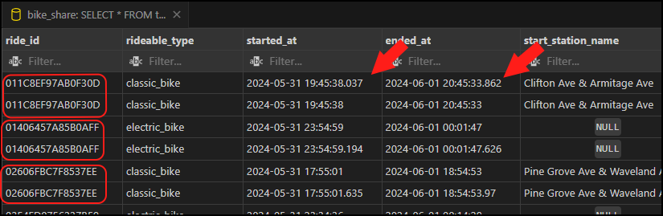

# Introduction

This case study is the capstone project for the Google Data Analytics Certificate
offered on Coursera. 

[click here...change me](Case-Study-1_How-does-a-bike-shared-navigate-speedy-success_.pdf)

[link to Coursera](https://www.coursera.org/learn/google-data-analytics-capstone/supplement/7PGIT/case-study-1-how-does-a-bike-share-navigate-speedy-success)

For this scenario, I will be taking on the role of a junior data analyst working for a fictional bike-share company named Cyclistic.


# Background and Objective

Cyclistic offers a bike-share program which includes over 5800 bicycles and 600
docking stations. Bikes can be unlocked from any dock and returned to any other
dock.

Customers can purchase a single-ride pass, a full-day pass, or an annual membership. Customers who purchase single-ride passes or full-day passes are referred to as
casual riders. Customers who purchase annual memberships are referred to as Cyclistic
members.

The Cyclistic finance analysts have determined that annual members are more profitable for the company than casual riders.  For this case study, my objective will be to find how casual riders and members use Cyclistic bikes differently, and provide recommendations on how to convert casual riders to members.


# Tools Used

- **SQL:**
- **PostgreSQL:**
- **VS Code:**
- **Tableau:**
- **Google Earth:**


# Preparation and Cleaning

### Data Source

While the company in this case study, Cyclistic, is fictional, the data for this
project comes from a real Chicago based bike-share service named Divvy. Divvy
has made their data available [here](https://divvy-tripdata.s3.amazonaws.com/index.html)
under this [license](https://divvybikes.com/data-license-agreement). Note that due
to data-privacy concerns, the data does not have any personally identifiable information.
For this project, I am using the twelve months of data from July of 2023 through
June of 2024 (i.e. Q3 and Q4 of 2023 and Q1 and Q2 of 2024).

The data is provided as .csv files, with a different .csv file for each month. The
fields in the .csv files are:

| Field                  | Description                                     |
|------------------------|-------------------------------------------------|
| ride_id                | Unique identifier for each ride                 |
| rideable_type          | Type of bicycle                                 |
| started_at             | Time ride started in YYYY-MM-DD HH:MM:SS format |
| ended_at               | Time ride ended in YYYY-MM-DD HH:MM:SS format   |
| start_station_name     | Name of the starting station                    |
| start_station_id       | ID of the starting station                      |
| end_station_name       | Name of the ending station                      |
| end_station_id         | ID of the ending station                        |
| start_lat              | Latitude of the starting station                |
| start_long             | Longitude of the starting station               |
| end_lat                | Latitude of the ending station                  |
| end_lng                | Longitude of the ending station                 |
| member_casual          | Member or Casual rider                          |

Many of the .csv files are over 100 MB in size, which is over the upload limit
of the free tools (Google's BigQuery and Google Sheets) that the Coursera Google Data
Analytics course covers.  To resolve this, I instead decided to use PostgreSQL.
The twelve .csv files for July of 2023 through June of 2024 were loaded into my
PostgreSQL database and joined into one table (trips_year) for analysis.

### Data Cleaning

Once joined, the table which has the rides from all twelve months, trips_year, 
had 5,734,381 records. Here are the steps I went through to clean the data.

#### 1. Remove Duplicate ride_id's

The first thing I did was to make sure that all of the ride id's were unique. I
ran a query to find out how many distinct ride_id's there were.

```sql
SELECT
    COUNT(DISTINCT ride_id)
FROM trips_year;
```
I found that there were 5,734,170 distinct ride_id's. Since there were 5,734,381
records total, that meant that there were 211 duplicates.

To find the duplicates, I ran the below query.

```sql
SELECT *
FROM trips_year
WHERE
    ride_id IN (
        SELECT
            ride_id
        FROM trips_year
        GROUP BY ride_id
        HAVING
            COUNT(ride_id) > 1
    )
ORDER BY
    ride_id;
```
I found that for each pair of duplicate ride_id's, one of the records would have
either a starting or ending time with milliseconds, while the other record did not.
All of the info in the other fields match up for each pair of duplicates. Below
is a screenshot that shows a sample which illustrates this.



I decided to remove the records which did not have milliseconds. To do that, I ran
the below query and confirmed that the duplicate ride_id's had been removed.

```sql
DELETE FROM trips_year
WHERE
    ride_id IN (
        SELECT
            ride_id
        FROM trips_year
        GROUP BY ride_id
        HAVING
            COUNT(ride_id) > 1
    ) AND
    (EXTRACT(MILLISECOND FROM started_at) % 1000 = 0 AND
    EXTRACT(MILLISECOND FROM ended_at) % 1000 = 0)
RETURNING
    ride_id;
```

#### 2. Clean Starting and Ending Locations


